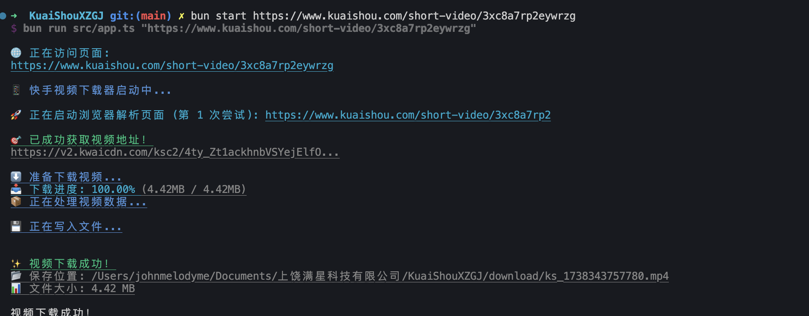

# 快手无水印视频下载器 📱

这是一个功能强大且易于使用的快手视频下载工具。它能够自动提取视频源地址并下载无水印原始视频，支持进度显示和断点续传。本工具采用最新的 Bun 运行时和 Puppeteer 技术，确保下载速度快且稳定。无论是普通视频还是直播回放，都能轻松下载保存。

得益于智能的视频源提取算法和防屏蔽机制，下载的视频都是原始质量，没有任何水印、台标或清晰度损失。对于重度快手用户和内容创作者来说，这是一个必备的视频素材管理工具。

## ✨ 特性

- 🎯 支持无水印下载快手视频
- 🚀 使用 Bun 运行时，下载速度快
- 💻 简单的命令行界面
- 📁 自动创建下载目录
- 📊 实时显示下载进度
- 🛡️ 稳定可靠的下载体验

## 🔧 安装

确保您的系统已安装 [Bun](https://bun.sh) 运行环境和 Chrome 浏览器，然后执行：

```bash
# 安装依赖
bun install
````

## 📖 使用方法

```bash
# 下载视频
bun start <快手视频链接>

# 查看帮助信息
bun start --help

# 示例
bun start https://v.kuaishou.com/xxxx
```
## 命令行参数说明
```bash
Usage: 快手视频下载器 [options] <url>

下载快手视频的命令行工具

使用方法:
$ bun start <视频链接>

示例:
$ bun start https://v.kuaishou.com/xxxx

注意事项:

- 链接必须是快手平台的有效视频链接
- 如果链接包含特殊字符，请使用引号包裹

Arguments:
url 快手视频链接 (必填)

Options:
-V, --version 显示版本号
-h, --help 显示帮助信息
```

## 🎯 使用提示

1. 确保提供的是有效的快手视频链接
2. 下载的视频将保存在 `download` 目录中
3. 需要稳定的网络连接
4. 如果遇到问题，请确保 Chrome 浏览器已正确安装

## ⚠️ 注意事项

- 本工具仅供学习交流使用
- 请勿用于任何商业用途
- 请遵守相关法律法规
- 注意视频版权问题

## 🔄 更新日志

### v1.0.0

- ✨ 首次发布
- 🎯 支持无水印下载
- 📊 添加下载进度显示

## 📺 演示效果

<div align="center">

<br />
<em>命令行下载演示</em>
</div>

### 特点展示

1. 🎯 **无水印下载**
   - 直接获取原始视频源
   - 清晰度无损失
   - 无任何水印叠加

2. 📊 **实时进度**
   - 显示下载百分比
   - 显示文件大小
   - 显示传输速度

3. 💻 **简单操作**
   - 一行命令完成下载
   - 自动创建下载目录
   - 智能命名保存


## 🌟 开源项目赞助计划

### 用捐赠助力发展

感谢您使用本项目！您的支持是开源持续发展的核心动力。  
每一份捐赠都将直接用于：  
✅ 服务器与基础设施维护  
✅ 新功能开发与版本迭代  
✅ 文档优化与社区建设

点滴支持皆能汇聚成海，让我们共同打造更强大的开源工具！

---

### 🌐 全球捐赠通道

#### 国内用户

<div align="center" style="margin: 40px 0">

<div align="center">
<table>
<tr>
<td align="center" width="300">

<br />
<strong>🔵 支付宝</strong>
</td>
<td align="center" width="300">

<br />
<strong>🟢 微信支付</strong>
</td>
</tr>
</table>
</div>
</div>

#### 国际用户

<div align="center" style="margin: 40px 0">
  <a href="https://qr.alipay.com/fkx19369scgxdrkv8mxso92" target="_blank">
    
  </a>
  
  <a href="https://ko-fi.com/F1F5VCZJU" target="_blank">
    
  </a>
  
  <a href="https://www.paypal.com/paypalme/ctkqiang" target="_blank">
    
  </a>
  
  <a href="https://donate.stripe.com/00gg2nefu6TK1LqeUY" target="_blank">
    
  </a>
</div>

---

### 📌 开发者社交图谱

#### 技术交流

<div align="center" style="margin: 20px 0">
  <a href="https://github.com/ctkqiang" target="_blank">
    
  </a>
  
  <a href="https://stackoverflow.com/users/10758321/%e9%92%9f%e6%99%ba%e5%bc%ba" target="_blank">
    
  </a>
  
  <a href="https://www.linkedin.com/in/ctkqiang/" target="_blank">
    
  </a>
</div>

#### 社交互动

<div align="center" style="margin: 20px 0">
  <a href="https://www.instagram.com/ctkqiang" target="_blank">
    
  </a>
  
  <a href="https://twitch.tv/ctkqiang" target="_blank">
    
  </a>
  
  <a href="https://github.com/ctkqiang/ctkqiang/blob/main/assets/IMG_9245.JPG?raw=true" target="_blank">
    
  </a>
</div>

---

🙌 感谢您成为开源社区的重要一员！  
💬 捐赠后欢迎通过社交平台与我联系，您的名字将出现在项目致谢列表！
